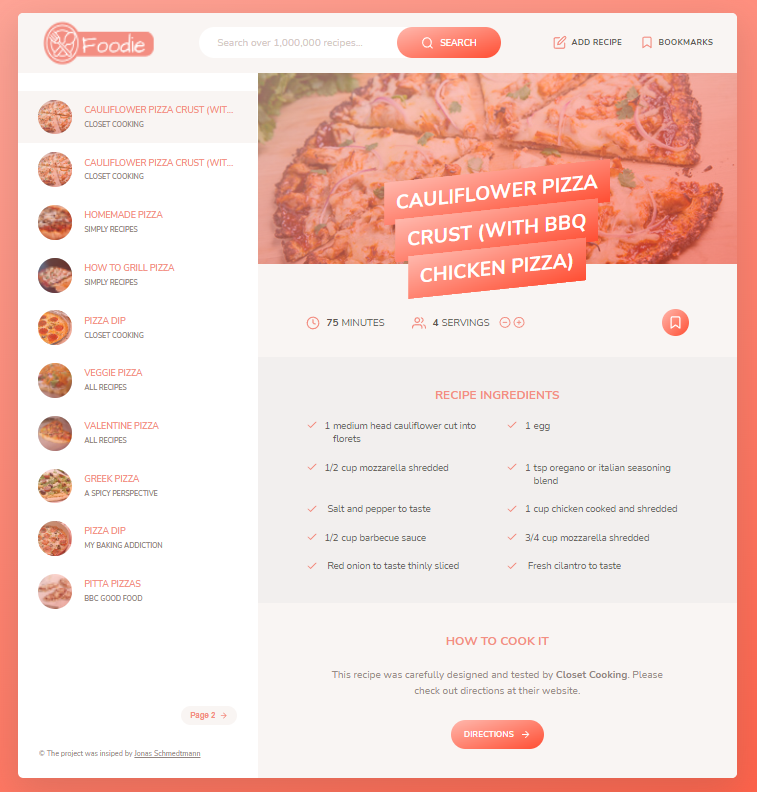

# The Foodie API project

This particular project has a special place in my heart because this was my first real-world pure javascript project.

---

---

### [See live version](https://foodie-app-ruben.netlify.app/#5ed6604591c37cdc054bcd09)

### Description

The Foodie app is a free-to-use seemingly simple web application, but with advanced features.  
Users can search for any dish/ingredient, and view the search results. You as a user also can upload your recipe, and add and delete recipes from your 'bookmarks', both of these are stored in local storage, so you can come back later and still see said recipes. The UX was enhanced by implementing pagination, so only a limited amount of search result will show up at first, not overcrowding the view height.  
Foodie utilizes a great third-party API called Forkify-API/v2, and the core file architecture is based on the so-called MVC model.

### Features

- Users can search for an ingredient/recipe and see the search results accordingly.
- Users can upload their recipes, which will be saved in local storage.
- Users can bookmark the recipes that they like so that they can view them later in the 'bookmarks' dropdown
- Pagination for the search results was implemented to enhance the UX

### Architecture

MVC (Model-View-Controller) is a pattern in software design commonly used to implement user interfaces, data, and controlling logic. It emphasizes the separation between the software's business logic and display. This "separation of concerns" provides a better division of labor and improved maintenance.

### Technologies used

- HTML5
- CSS3 - Sass
- Javascript
- Parcel
- NPM

### What did I learn?

This project helped me improve my skills in multiple areas.

- I gained experience using and implementing the MVC software design pattern
- I leveled up my UI/UX design skills
- This was the first time I got myself into using Sass and having a fundamental CSS file structure

### Credit

_The project architecture and design were heavily inspired by [Jonas Schmedtmann](https://twitter.com/jonasschmedtman)_
